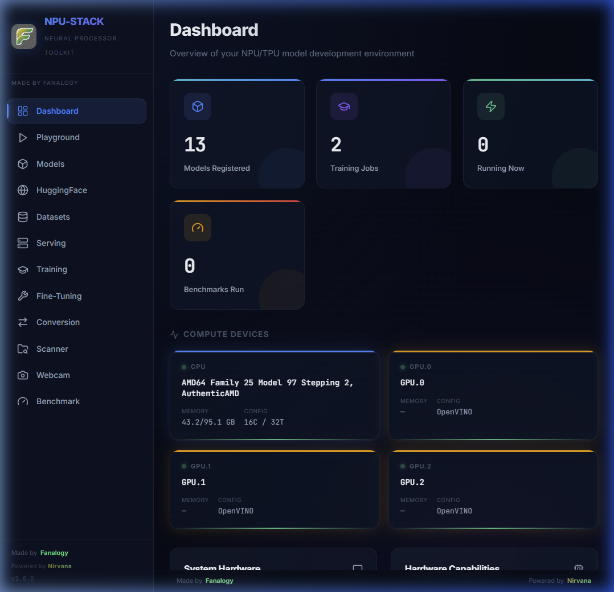
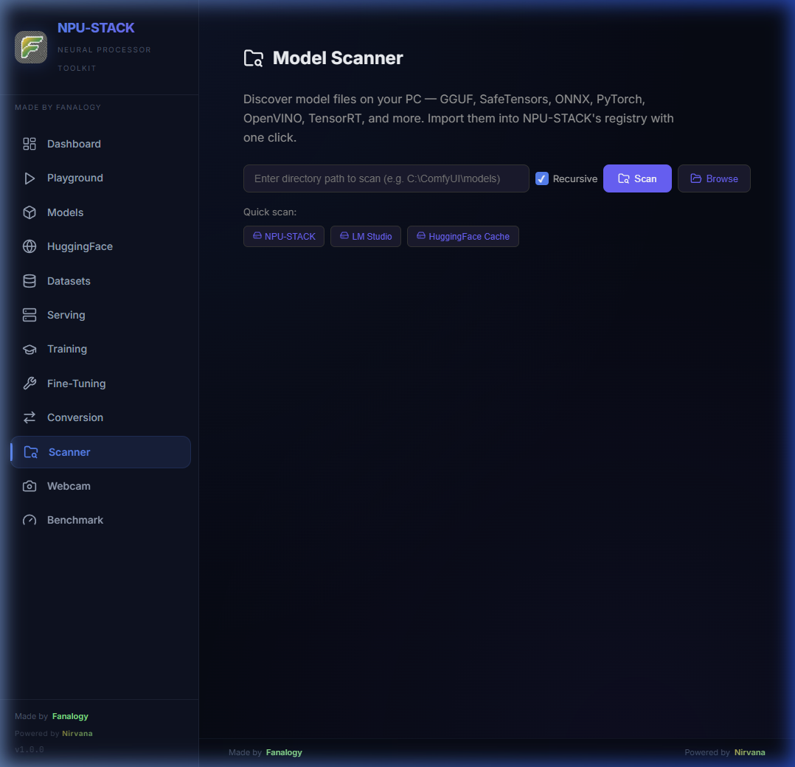
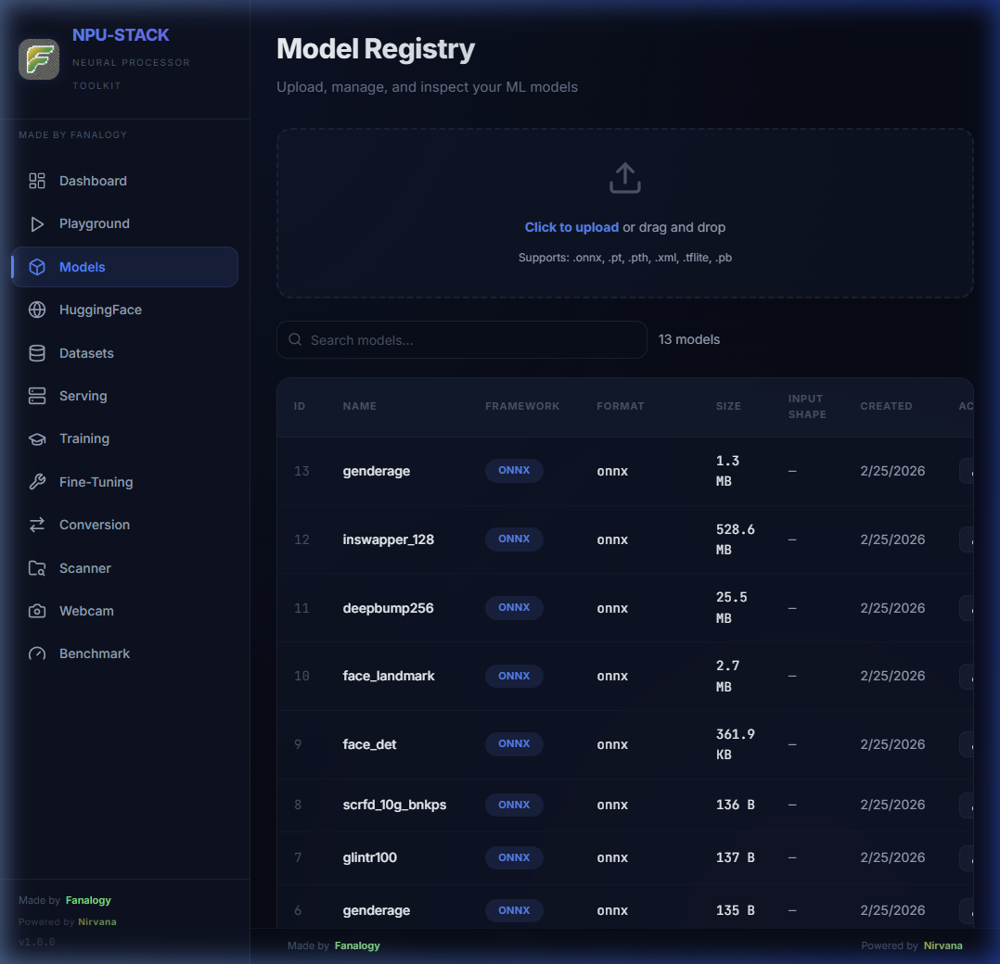
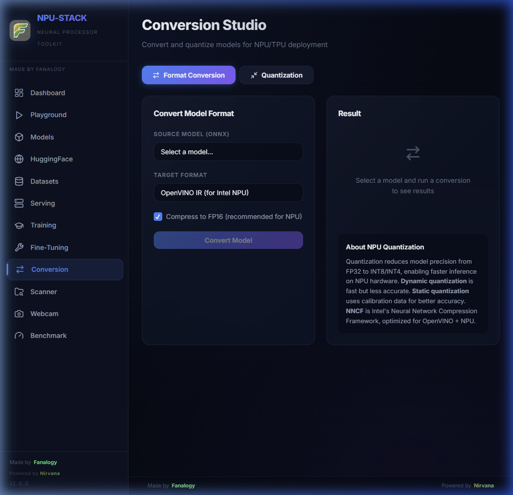

<div align="center">

# ⚡ NPU-STACK

### Full-Stack Neural Processor AI Toolkit

**Train · Fine-Tune · Convert · Quantize · Serve · Benchmark** AI models on **NPU · TPU · GPU · CPU**

[](https://github.com/chainchopper/NPU-STACK/stargazers)
[](https://github.com/chainchopper/NPU-STACK/network/members)
[](LICENSE)
[](https://github.com/chainchopper/NPU-STACK/commits)

[](https://python.org)
[](https://react.dev)
[](https://fastapi.tiangolo.com)
[](https://docker.com)
[](https://platform.openai.com/docs/api-reference)

</div>

---

## 🎯 What is NPU-STACK?

NPU-STACK is an **open-source, full-stack AI toolkit** for developing, serving, and deploying machine learning models on every hardware accelerator — NPUs, TPUs, GPUs, and CPUs. It ships with an **OpenAI-compatible API**, making it a self-hosted alternative to LM Studio, Ollama, and OpenAI.

### ✨ Key Features

| Feature | Description |
|---------|-------------|
| 🖥️ **Model Serving** | OpenAI-compatible `/v1` API — chat completions, embeddings, streaming SSE. Works with LangChain, Open WebUI, and more |
| 🏋️ **Fine-Tuning** | LoRA/QLoRA via PEFT. Custom datasets, hyperparameters, real-time metrics |
| 🧪 **Playground** | Test models interactively — text generation, image classification, object detection, image synthesis |
| 🤗 **HuggingFace Hub** | Search, browse, one-click download models from HuggingFace |
| 🔄 **Convert & Quantize** | PyTorch → ONNX → OpenVINO IR. INT8/INT4 quantization with NNCF |
| 📊 **Benchmark** | Latency (p50/p95/p99), throughput, memory profiling across CPU/GPU/NPU |
| 📁 **Dataset Manager** | Upload, organize, auto-detect datasets (images, CSV, JSON, Parquet) |
| 🌐 **Web Dashboard** | Premium React UI with real-time training charts via WebSocket |
| 🦙 **GGUF Studio** | 5-tab studio for inspecting, quantizing (21 formats), converting, and LoRA merging |
| 🪄 **Onboarding Wizard** | Interactive 5-step tour guiding new users from import to deployment |
| ☁️ **Edge & Cloud** | Connect to NVIDIA NIM APIs, compile Vitis AI `.xmodel`s, and manage CVEDIA-RT |
| 🐳 **Docker Deploy** | Single `docker compose up` launches the full stack |
| 📷 **Webcam Detection** | Real-time object detection with bounding box overlays |
| 🔍 **Model Scanner** | Discover model files on your PC (12+ formats) with interactive folder browser |

---

## ✅ Verified current snapshot

- **Backend:** FastAPI app imports successfully and currently mounts **136 routes**.
- **Frontend:** React 18 + Vite SPA with **17 navigable pages** in `frontend/src/App.jsx`.
- **Serving:** OpenAI-compatible `/v1` API is wired into the frontend via shared URL helpers instead of hardcoded `localhost` origins.
- **Dev proxy:** Vite proxies `/api`, `/v1`, and `/ws` to the backend during local development.
- **Validation:** Frontend production build passes, and backend smoke coverage now lives in `tests/test_backend_smoke.py`.

---

## 📸 Screenshots

<div align="center">

| Dashboard | Model Scanner |
|:-:|:-:|
|  |  |

| Model Registry | Conversion Studio |
|:-:|:-:|
|  |  |

</div>

## 🖥️ OpenAI-Compatible Model Serving

NPU-STACK includes a fully OpenAI-compatible API server. Use it as a drop-in replacement for OpenAI in any application.

### Endpoints

| Method | Endpoint | Description |
|--------|----------|-------------|
| `GET` | `/v1/models` | List available models |
| `POST` | `/v1/chat/completions` | Chat completion (streaming + non-streaming) |
| `POST` | `/v1/completions` | Text completion |
| `POST` | `/v1/embeddings` | Generate text embeddings |
| `POST` | `/v1/models/load` | Load a model into memory |
| `POST` | `/v1/models/unload` | Unload model from memory |

### Usage

```python
from openai import OpenAI

client = OpenAI(
    base_url="http://localhost:8000/v1",
    api_key="any"  # Not required for local
)

# Chat completion
response = client.chat.completions.create(
    model="my-model",
    messages=[{"role": "user", "content": "Hello!"}],
    stream=True
)

for chunk in response:
    print(chunk.choices[0].delta.content, end="")
```

```bash
# cURL
curl http://localhost:8000/v1/chat/completions \
  -H "Content-Type: application/json" \
  -d '{"model": "my-model", "messages": [{"role": "user", "content": "Hello!"}]}'
```

### Compatibility

Works with: **OpenAI Python/JS SDK** · **LangChain** · **LlamaIndex** · **Open WebUI** · **Chatbot UI** · **Vercel AI SDK** · **cURL** · **Postman**

---

## 🏋️ Fine-Tuning (LoRA/QLoRA)

Fine-tune any model in the registry with parameter-efficient methods:

```python
import requests

requests.post("http://localhost:8000/api/finetune/start", data={
  "model_id": 1,
  "dataset": "my-dataset.jsonl",
  "epochs": 3,
  "batch_size": 4,
  "learning_rate": 2e-4,
  "use_lora": True,
  "lora_r": 16,
  "lora_alpha": 32,
  "text_column": "text",
  "max_length": 512,
})
```

- Background training with real-time step/epoch/loss tracking
- Supports custom uploaded datasets and HuggingFace datasets
- Fine-tuned adapters saved to model registry

---

## 🤖 AI Context Protocol (MCP) Server

Expose NPU-STACK directly to **Claude Desktop**, **Cursor**, or any MCP-compatible AI Assistant! This gives your AI the ability to compile models to NPU formats and query your system hardware.

Add the following to your `claude_desktop_config.json` (or equivalent client config):

```json
{
  "mcpServers": {
    "npu-stack": {
      "command": "python",
      "args": [
        "J:\\NPU-STACK\\backend\\mcp_server.py"
      ]
    }
  }
}
```

*Note: Update the path to `mcp_server.py` and ensure the `python` command resolves to your local NPU-STACK `venv` if you aren't installing globally.*

---

## 🚀 Quick Start

### Windows (Recommended)

```bash
git clone https://github.com/chainchopper/NPU-STACK.git
cd NPU-STACK
setup.bat       # Downloads Python, creates venv, installs everything
run-all.bat     # Launches backend + frontend + API
```

> **Note:** `llama-cpp-python` (GGUF inference) is an **optional** dependency. If a pre-built wheel is unavailable for your Python version or platform, setup will print an `[INFO]` warning and continue — the core platform works without it. Use `docker compose up --build` for full out-of-the-box GGUF support.

### Linux / macOS

```bash
git clone https://github.com/chainchopper/NPU-STACK.git
cd NPU-STACK
chmod +x *.sh
./setup.sh      # Creates venv, installs dependencies, generates `.env`
./run-all.sh    # Launches backend + frontend with proper SIGINT handling
```

### Docker

```bash
docker compose up --build
```

### Manual

```bash
# Backend
cd backend && pip install -r requirements.txt && python main.py

# Frontend
cd frontend && npm install && npm run dev
```

The frontend development server uses relative API calls and proxies these backend surfaces automatically:

- `/api` → `http://localhost:8000`
- `/v1` → `http://localhost:8000`
- `/ws` → `ws://localhost:8000`

**Access:**

- 🌐 Dashboard: `http://localhost:5173`
- 📡 API Docs: `http://localhost:8000/api/docs`
- 🤖 OpenAI API: `http://localhost:8000/v1`

### Quick validation

```bash
# Frontend smoke tests
cd frontend && npm run test

# Frontend production build
cd frontend && npm run build

# Backend smoke tests
python -m unittest discover -s tests -p test_backend_smoke.py
```

---

## 🏗️ Architecture

```text
├── backend/
│   ├── main.py                # FastAPI entry (23 feature routers, 136 total routes verified)
│   ├── database.py            # SQLAlchemy models
│   ├── routers/
│   │   ├── models.py          # Model registry CRUD
│   │   ├── training.py        # Training job management
│   │   ├── inference.py       # Multi-task inference
│   │   ├── conversion.py      # Format conversion & quantization
│   │   ├── benchmark.py       # Performance benchmarking
│   │   ├── serving.py         # OpenAI-compatible /v1 API
│   │   ├── finetuning.py      # LoRA/QLoRA fine-tuning
│   │   ├── huggingface.py     # HuggingFace Hub search & download
│   │   ├── datasets.py        # Dataset management
│   │   ├── scanner.py         # Local model scanner (12+ formats)
│   │   ├── webcam.py          # WebSocket webcam inference
│   │   ├── gguf_pipeline.py   # GGUF inspect / quantize / split / LoRA merge
│   │   ├── flm.py             # FastFlowLM runtime integration
│   │   ├── devices.py         # Edge Fleet device registry + flashing helpers
│   │   ├── nim.py             # NVIDIA NIM integration
│   │   ├── cvedia.py          # CVEDIA-RT integration
│   │   ├── vitis_compiler.py  # AMD Vitis compilation pipeline
│   │   ├── civitai.py         # Civitai search / download flows
│   │   ├── agent.py           # Agent-oriented backend endpoints
│   │   └── filebrowser.py     # Interactive file/folder browser
│   └── services/              # Business logic
│       ├── benchmark_service.py  # 12-capability hardware detection
│       ├── conversion_service.py # OpenVINO/NNCF/Vitis conversion
│       ├── opencv_service.py     # cv2.dnn inference & preprocessing
│       └── gguf_service.py       # llama.cpp GGUF inference
├── frontend/
│   └── src/
│       ├── App.jsx            # Router + sidebar (17 pages verified)
│       ├── components/
│       │   └── FolderBrowser.jsx  # Modal folder picker
│       └── pages/
│           ├── Dashboard.jsx  # Overview + system info
│           ├── Playground.jsx # Interactive model testing
│           ├── Models.jsx     # Model registry
│           ├── ModelHub.jsx   # HuggingFace / Civitai discovery
│           ├── HubPublisher.jsx # Hub publishing workflow
│           ├── Datasets.jsx   # Dataset manager
│           ├── DataIngestion.jsx # Upload / extract / dataset build
│           ├── Serving.jsx    # Model serving UI
│           ├── Training.jsx   # Training console
│           ├── FineTuning.jsx # Fine-tuning config & jobs
│           ├── Conversion.jsx # Format & quantization studio
│           ├── GGUFStudio.jsx # llama.cpp GGUF tooling suite
│           ├── FastFlowLM.jsx # FLM runtime management
│           ├── Scanner.jsx    # Model file scanner
│           ├── WebcamTest.jsx # Real-time object detection
│           ├── Benchmark.jsx  # Performance lab
│           └── EdgeFleet.jsx  # Edge device discovery / firmware ops
├── tests/
│   └── test_backend_smoke.py  # Core backend smoke coverage
├── docs/screenshots/          # App screenshots
├── web/                       # Promotional website
└── docker-compose.yml
```

---

## ⚙️ Hardware Support

| Hardware | Backend | Status |
|----------|---------|--------|
| NVIDIA CUDA GPUs | PyTorch CUDA, ONNX Runtime CUDA, TensorRT | ✅ |
| AMD ROCm GPUs | PyTorch HIP, ONNX Runtime ROCm | ✅ |
| AMD Vitis AI / Alveo FPGA | vai_q_onnx, Quark quantizer, xbutil | ✅ |
| Intel NPU (Core Ultra) | OpenVINO NPU plugin | ✅ |
| Google Coral Edge TPU | TFLite Delegate | ✅ |
| Rockchip NPU (RK3588, RV1103) | RKNN Toolkit 2, RKNN Lite 2, rk-llama.cpp | ✅ |
| DirectML (Windows) | ONNX Runtime DML Provider | ✅ |
| OpenCV DNN | cv2.dnn with CPU/OpenCL/CUDA targets | ✅ |
| CPU (x86/ARM) | ONNX Runtime, OpenVINO CPU | ✅ |

---

## 🔧 Configuration

Edit `.env` in the project root:

| Variable | Default | Description |
|----------|---------|-------------|
| `NPU_STACK_API_KEY` | — | Optional API key for /v1 endpoints |
| `HUGGINGFACE_TOKEN` | — | HuggingFace token for private models |
| `HOST` | 0.0.0.0 | Server bind address |
| `PORT` | 8000 | Server port |
| `MODEL_STORAGE` | backend/data/models | Model storage path |

---

## 🤝 Contributing

We welcome contributions! All PRs should target the `dev` branch.

```bash
git clone https://github.com/chainchopper/NPU-STACK.git
cd NPU-STACK && git checkout dev
# make your changes, then push and open a PR
```

---

## 📄 License

MIT License — see [LICENSE](LICENSE) for details.

---

<div align="center">

Made by **[Fanalogy](https://github.com/chainchopper)** · Powered by **Nirvana**

⭐ **Star this repo** to support the project!

</div>
