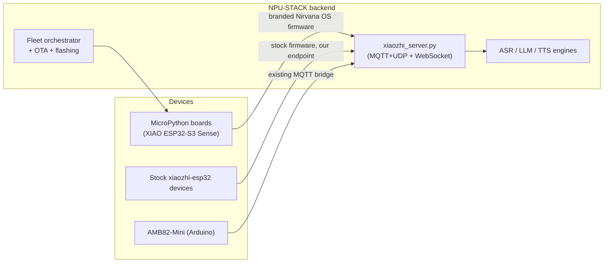

# Nirvana Fleet Intelligence — Migration Plan

Goal: make Nirvana a **self-hosted, full-suite voice-AI fleet platform** that is a
drop-in alternative to `xiaozhi.me` — same wire protocol, our own branding, our own
backend services, and auto-installable firmware for MicroPython-capable boards.

This document describes the NPU-STACK integration contract. Nirvana OS source
and internal device firmware are maintained in a separate firmware product
repository; private training material is maintained separately as well. NPU-STACK
must consume approved firmware releases/manifests or public board adapters, not
private firmware working paths. See [`REPOSITORY_BOUNDARIES.md`](REPOSITORY_BOUNDARIES.md).

## Current State (verified)

- **Backend already speaks xiaozhi.** `backend/services/xiaozhi_server.py` +
  `backend/routers/xiaozhi_router.py` implement the server side of the MQTT+UDP
  hybrid protocol: hello/session registration, UDP audio channel (AES), STT → LLM
  (Nirvana/DeepSeek) → TTS routing, MCP relay, alerts/emotion.
- **Fleet orchestration exists.** `services/fleet_orchestrator.py` detects device
  family (esp32 / rp2040 / linux), and `services/edge_discovery.py` handles
  flashing: `esp_flash_firmware`, `rp2040_flash_uf2`, `prepare_firmware_bundle`,
  `install_prepared_bundle`.
- **ESP-IDF toolchain service exists.** `services/idf_service.py` prefers the
  workspace-bundled `libraries/esp-idf` (**already v6.0.2**), falls back to
  `~/.espressif`. Standalone clone for the VS Code extension / manual firmware
  builds: `j:\esp-idf-v6.0.2`.
- **AMB82-Mini is a dead end for MicroPython.** It stays as the Arduino reference
  device; the fleet OS moves to MicroPython-capable boards.

## Reference Projects

| Project | What we take from it |
|---------|---------------------|
| `78/xiaozhi-esp32` (29k★, MIT) | Wire protocol spec (MQTT+UDP + WebSocket), board bring-up, wake-word (ESP-SR), device-side MCP. Targets **ESP-IDF v6.0.2**. |
| `hackers365/xiaozhi-esp32-server-golang` (MIT) | Feature parity checklist for our backend: ASR→LLM→TTS streaming, VAD, speaker ID, MCP market, voice clone, knowledge base, OTA console (:8080). |
| `QuecPython/solution-xiaozhiAI` | Precedent: xiaozhi client in Python/MicroPython — proves the MicroPython client path. |
| Seeed `XIAO ESP32-S3 Sense` | Primary MicroPython target board (mic + OV2640 camera + speaker out + battery charge/management, I2C+SPI for ILI9341). |

## Target Architecture

## Firmware Tiers

Firmware tiers are release products coordinated by NPU-STACK, not an instruction
to place every firmware implementation in this public repository.

1. **Tier A — ESP-IDF (C/C++):** fork/configure `xiaozhi-esp32` with Nirvana
   branding, pointing at our backend endpoint. Built with ESP-IDF v6.0.2.
2. **Tier B — MicroPython (primary):** branded "Nirvana OS" image built on the
   standard MicroPython demo stack (WiFi/BLE management, OTA, app-store
   marketplace, home-screen apps, update channels via GitHub URLs + access keys).
   Defaults: NPU-STACK backend URL, Nirvana branding, our update channel.

## Backend Work (feature parity)

Build out `xiaozhi_server.py` / fleet services to full parity with the golang
reference:

- [x] WebSocket transport — `ws://:8010/api/fleet/voice/ws` (hello/listen/abort/mcp/goodbye + Opus v1/v2/v3 framing); verified with `scripts/xiaozhi_ws_probe.py`
- [ ] VAD/ASR/LLM/TTS engine plugins (OpenAI-compatible, Ollama, EdgeTTS, CosyVoice)
- [ ] Device management console (registry, live latency, message injection)
- [ ] OTA channel with signed artifacts (we have fleet OTA; add channel/versioning)
- [ ] MCP marketplace + device/agent-dimension remote calls
- [ ] Voice clone + knowledge base (optional, later phases)

## Flashing & Deployment Bake-In

- Extend `flash_service.py` / `edge_discovery.py` to flash the branded MicroPython
  image directly (esptool + UF2 paths already exist).
- Add an update-channel manifest (GitHub URL + access key) consumed by the
  MicroPython app-store so devices self-update from our releases.
- Branding pass: Nirvana OS splash, default backend endpoint, fleet provisioning
  token on first boot.

## Migration Phases

| Phase | Deliverable | Exit criteria |
|-------|-------------|---------------|
| 0 | ESP-IDF v6.0.2 toolchain | `idf.py --version` works in extension + backend |
| 1 | Backend speaks full xiaozhi (WS + MQTT/UDP) | stock xiaozhi device attaches to our endpoint |
| 2 | Branded MicroPython image on XIAO ESP32-S3 Sense | screen + mic + speaker + camera verified |
| 3 | Flash/deploy bake-in + update channels | web flasher installs branded image; OTA self-updates |
| 4 | Feature parity (MCP, voice clone, knowledge base) | parity checklist closed |

## Open Decisions

1. Extend Python `xiaozhi_server.py` to parity, or run the golang server as a
   sidecar and bridge into fleet management? **Rec: extend Python** (protocol is
   already ours; single codebase).
2. Primary MicroPython board: XIAO ESP32-S3 Sense vs alternatives (ESP32-S3-BOX-3,
   M5Stack CoreS3, XIAO Round Display).
3. Update channel access-key model: per-fleet key vs per-device key.

## Future Ideas

- **ESP-NOW daisy-chain:** two XIAOs (one seated in the Round Display, one pressed
  into a Grove Vision AI V2 kit) + the Grove Vision V2 can link over ESP-NOW
  (no AP/router needed) for a multi-node sensor+display mesh. Note: Grove Vision
  AI V2 is a WiseEye2 HX6538 (not an ESP32) — bridge it from the XIAO over I2C
  rather than flashing it directly; ESP-NOW runs XIAO↔XIAO.
- **Camera on XIAO Sense:** use the prebuilt OV2640 MicroPython firmware from
  the separately managed firmware/release workspace as the camera reference;
  note it is an older MicroPython (2023) — port the OV2640 driver to v1.28 for
  the main image. Do not treat a local binary or private firmware checkout as a
  public NPU-STACK dependency.
